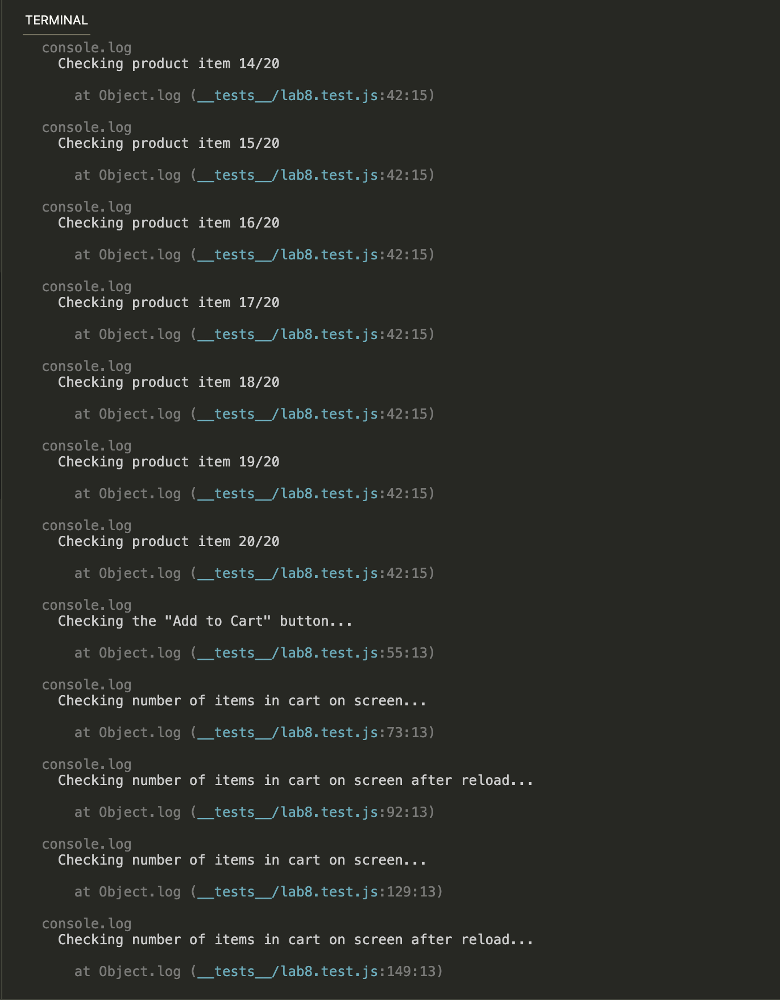

# Lab 8 - Starter

Name: Duy Quoc Vu

1) Within a Github action that runs whenever code is pushed. It is because the Github Action will check whether the test is passed whenever new changes are pushed to the code.

2) No. Because E2E testing is not mainly used for testing functions, hence not a necessary way to check the correctness of any functions' output. Instead, E2E testing is mainly for UI testing that involves emulating user actions from start to finish.

3) No. Unit test will not be useful to test the "message" feature because it is not able to cover all the actions of sending and receiving messages and also it won't be able to check whether the messages are displaced correctly on the user's end. E2E would be useful here as it can emulate all the user's actions on sending and receiving messages.

4) Yes. The "max message length" is the property that can be simply checked by a function, hence unit test is useful here. It just call the function to check whether the message length limit is correct.

# Screenshots

